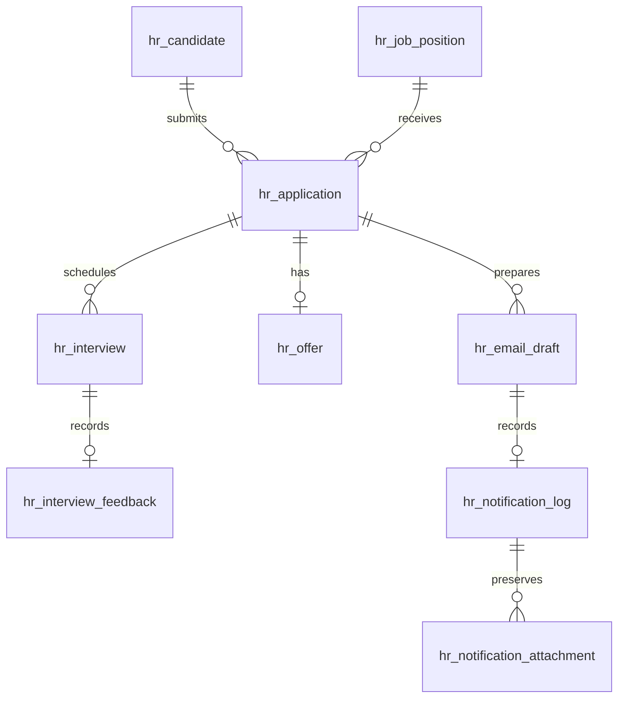

# 数据库结构与一致性

本地数据库名默认 `jrs_hr_fullstack`；团队库由 DB_NAME 指定；MySQL 8.0.16+，全部表使用 InnoDB，数据库字符集 utf8mb4。`database/schema.sql` 是建表源文件。

## 表与职责

| 表 | 保存内容 |
|---|---|
| hr_workspace | 单个 HR 工作区的 revision；写入事务锁定这行 |
| hr_user | HR 账号、角色、资料、scrypt 密码哈希 |
| hr_session | 会话令牌的哈希、CSRF token、到期时间 |
| hr_login_limit | 登录限流窗口 |
| hr_job_position | 职位、要求、状态 |
| hr_candidate | 候选人联系信息、技能、内部备注 |
| hr_application | 候选人与职位的关系、招聘阶段、优先级、拒绝原因、五年保留期开始时间 |
| hr_application_note | 每条申请的内部记录及作者、时间 |
| hr_interview | 时间、面试官、地点、形式、状态 |
| hr_interview_feedback | 每次面试的评分、建议和反馈 |
| hr_offer | 每条申请的薪资、日期、审批、接受状态 |
| hr_task | 跟进任务、负责人、截止日、完成状态 |
| hr_email_template | 模板内容与归档状态 |
| hr_email_draft | 候选人邮件正文快照与发送状态 |
| hr_system_notification | 新申请和状态更新的内部事件 |
| hr_notification_read | 通知与 HR 用户的联合主键，已读互不干扰 |
| hr_notification_log | 邮件服务器接受后的正文、收件人、模板、事件和时间快照 |
| hr_notification_attachment | 成功发送时的附件快照 |
| hr_resume | 候选人最新 PDF 和元数据，最大 5 MB |
| hr_audit_log | 操作人、时间、状态变化、内部备注 |
| hr_request | 每个 HR 的请求去重键、摘要、已提交结果 |

关键关系（省略会话、模板等辅助表）：

业务实体分表保存，通过外键连接。`skills`、`requirements` 是 JSON 字符串数组；没有把整个工作区塞进一个 JSON 字段。薪资使用 DECIMAL，候选人与职位组合唯一；面试表的生成列限制同一申请只有一条 Scheduled 面试。服务层另外检查候选人、面试官和房间的重叠，允许首尾相接的时段。

## 一次保存如何完成

事务先 `SELECT ... FOR UPDATE` 锁住工作区版本行，检查请求去重记录与客户端版本，读取数据库快照并应用业务规则。仅把发生变化的行写回各表，同时提交操作记录、内部通知和 revision。任何一步失败都会回滚。

这是为毕业项目单个 HR 工作区设计的清晰方案：完整读取和串行化写入能保护跨申请的排期一致性，也便于与已有前端对接。它适合当前 115 条示例申请的规模；如果以后处理很大数据量，应改为按资源查询、行级版本与专门的排期锁。不要把当前实现当作大规模多租户服务。

## 时间与通知

- 面试、任务截止日、Offer 日期都按新加坡时间解释。面试日期/时间分列保存，服务端计算使用 `+08:00`；不依赖运行电脑时区。
- 创建、操作、发送时间保存为 UTC ISO 时间字符串，显示时转换为 Asia/Singapore。
- `Draft` 表示未发送；`Sending` 表示正在交给 SMTP；`Sent` 表示 SMTP 服务器已接受。`Sent` 不保证已进入收件箱，也不表示候选人已读。
- `Superseded` 表示后续操作替换了草稿，不能再发送。`Uncertain` 表示发送结果无法确认；不建立成功日志、不自动重发，先检查邮箱服务商记录。
- 进程中断超过 5 分钟的 `Sending` 会转为 `Uncertain`，解除申请修改锁。原消息仍不会自动重发。
- 模板归档和职位关闭都保留历史；历史邮件保留发送时的收件人、内容、模板名称与附件，之后编辑资料不会改写历史。

## 初始化与示例数据

`db:init` 仅限本地，创建缺失的数据库和表、初始 HR 账号及 5 类模板，不删除记录，也不重置已有密码。`db:seed` 仅限本地，只允许对没有职位、候选人和申请的数据库执行，插入 115 条虚构申请、10 个职位和 24 个历史面试。示例邮箱均为 example.com，发送接口会拒绝向其发送邮件。

`schema.sql` 是 v2.1 新安装结构。旧表通过 server/retention.cjs 的显式幂等迁移新增 retention_started_at；共享库使用协调人执行的 db:migrate，运行时不会改表。

账号和内部 HR 数据仅向已登录 HR 开放；只有 HR_MANAGER 可以批准 Offer 或管理模板。生产使用 HTTPS、专用数据库账号并按组织要求设置备份和保留期限。

## 五年数据清理

Offer / Rejected 的 retention_started_at、关联资料删除范围和备份边界详见 RETENTION.md。删除独立 Candidates 页面不代表删除 hr_candidate 表，申请与简历仍引用它。
